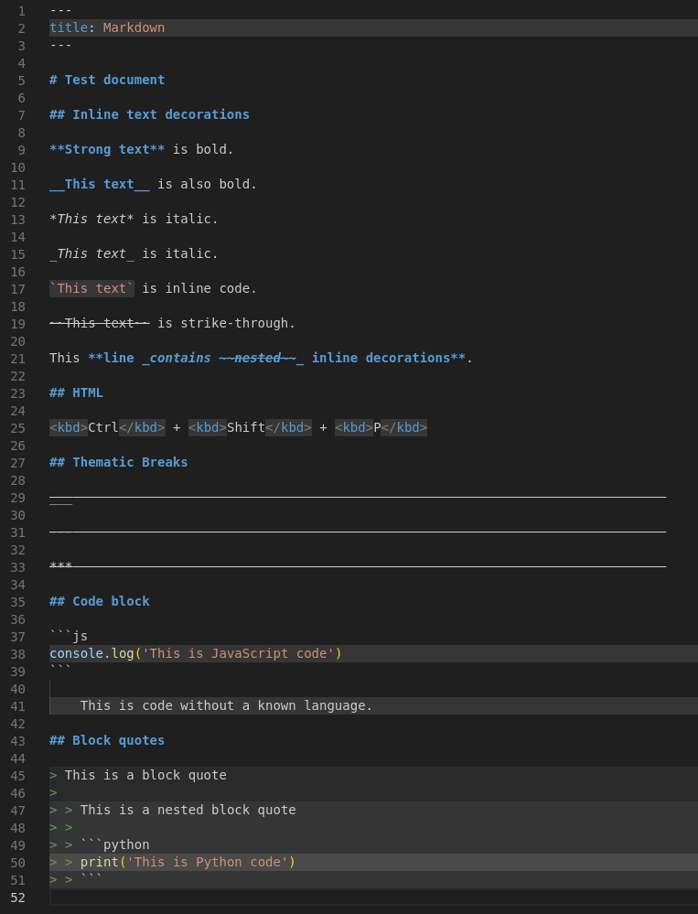

# Markdown WYSIWYG

[](https://github.com/remcohaszing/vscode-markdown-wysiwyg/actions/workflows/ci.yaml)
[](https://marketplace.visualstudio.com/items?itemName=remcohaszing.markdown-wysiwyg)
[](https://marketplace.visualstudio.com/items?itemName=remcohaszing.markdown-wysiwyg)
[](https://open-vsx.org/extension/remcohaszing/markdown-wysiwyg)
[](https://open-vsx.org/extension/remcohaszing/markdown-wysiwyg)

This Visual Studio Code extension provides a WYSIWYG-like experience for markdown and MDX files.
This extension is experimental. Feedback is welcome, and changes are likely to happen.

## Table of Contents

- [Installation](#installation)
- [Usage](#usage)
- [Features](#features)
- [License](#license)

## Installation

In Visual Studio Code open the command palette using <kbd>Ctrl</kbd> + <kbd>Shift</kbd> +
<kbd>P</kbd>, paste the following command, and press <kbd>Enter</kbd>.

```
ext install remcohaszing.markdown-wysiwyg
```

## Usage

This extension is activated automatically when you open a markdown or MDX file.

## Features

This extension provides some text decorations that make the markdown and MDX editing experience feel
close to a WYSIWYG experience.



The following decorations are supported:

- Emphasis text is italic.
- Strong text is bold.
- Headers are bold.
- Deleted text is strike-through.
- Thematic breaks have an extended strike-through effect.
- Inline code has a darker background in light mode, and a lighter background in dark mode.
- HTML tags have a darker background in light mode, and a lighter background in dark mode.
- Code blocks have a darker background in light mode, and a lighter background in dark mode.
- Frontmatter has a darker background in light mode, and a lighter background in dark mode.
- Block quotes have a darker background in light mode, and a lighter background in dark mode. This
  effect increases as more block quotes are nested.
- MDX expressions have a darker background in light mode, and a lighter background in dark mode.

## License

[MIT](LICENSE.md) © [Remco Haszing](https://github.com/remcohaszing)
